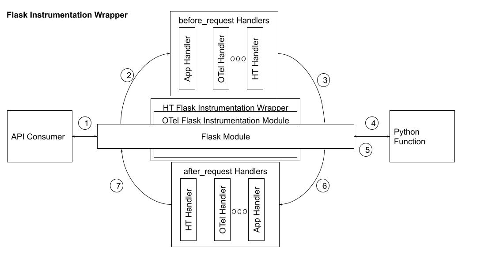

# Architecture

# Wrapping OpenTelemetry Instrumentation Modules

# Flask Instrumentation Wrapper Architecture


# Assumptions
* Tested with [Python v3.7.9](https://www.python.org/downloads/release/python-379/).

# Setup
1. run:
```
pip install opentelemetry-api
pip install opentelemetry.instrumentation.requests
pip install opentelemetry.sdk
pip install flask
```
2. run: ```cd test```
3. run: ```python flask_test.sh```
4. run: ```./run_tests.sh```
5. You should see something like the following:
```
flask_test.py  run_test.sh
[broeckel@nakita test]$ python flask_test.py
Initializing Agent.
Initializing AgentInit object.
Calling registerFlaskApp.
Calling flaskInit().
 * Serving Flask app "flask_test" (lazy loading)
 * Environment: production
   WARNING: This is a development server. Do not use it in a production deployment.
   Use a production WSGI server instead.
 * Debug mode: on
 * Running on http://127.0.0.1:5000/ (Press CTRL+C to quit)
 * Restarting with stat
Initializing Agent.
Initializing AgentInit object.
Calling registerFlaskApp.
Calling flaskInit().
 * Debugger is active!
 * Debugger PIN: 308-262-137
{
    "name": "/",
    "context": {
        "trace_id": "0xfbf3b2c70ca4ad55caf1f3c5cfa48314",
        "span_id": "0x20c93c2e3262fe87",
        "trace_state": "[]"
    },
    "kind": "SpanKind.SERVER",
    "parent_id": null,
    "start_time": "2021-03-05T01:54:44.313022Z",
    "end_time": "2021-03-05T01:54:44.320403Z",
    "status": {
        "status_code": "UNSET"
    },
    "attributes": {
        "http.method": "GET",
        "http.server_name": "127.0.0.1",
        "http.scheme": "http",
        "net.host.port": 5000,
        "http.host": "localhost:5000",
        "http.target": "/",
        "net.peer.ip": "127.0.0.1",
        "http.user_agent": "curl/7.66.0",
        "net.peer.port": 35500,
        "http.flavor": "1.1",
        "http.route": "/",
        "http.status_text": "OK",
        "http.status_code": 200
    },
    "events": [],
    "links": [],
    "resource": {
        "telemetry.sdk.language": "python",
        "telemetry.sdk.name": "opentelemetry",
        "telemetry.sdk.version": "1.0.0rc1",
        "service.name": "unknown_service"
    }
}
127.0.0.1 - - [04/Mar/2021 17:54:44] "GET / HTTP/1.1" 200 -
```
The python agent output is now written to a log file managed by the logging module. This can currently be found in ${REPO_HOME}/test/agent.log.

# Requirements
* [Python OTel Python Agent](https://github.com/open-telemetry/opentelemetry-python) must not be modified.
* [Python OTel Python Agent](https://github.com/open-telemetry/opentelemetry-python) must be installed (and usable) through pip.
* A set of wrapper classes must be created around each instrumentation module in [Python OTel Python Agent](https://github.com/open-telemetry/opentelemetry-python) to facilitate custom behavior for capturing deeper metrics without modifying those instrumentation modules.
* Initially, 5-10 lines of initialization code can be called from application to be called. Later, we would want to make this transparent.
* Initially extend the [flask framework](https://flask.palletsprojects.com/en/1.1.x/) instrumentation module to capture request and response headers and message bodies. Other instrumentation modules will be done later.
* The span data object for the extended isntrumentation module must match the [Hypertrace specification](https://github.com/hypertrace/specification).
* The Hypertrace Python Agent configuration must match [Agent Configurtion schema](https://github.com/hypertrace/agent-config).
* Use existing test framework in opentelmetry agent to the greatest extent possible.

# Important Links
* [DJango Python Instrumentation Entrypoint](https://github.com/open-telemetry/opentelemetry-python-contrib/blob/main/instrumentation/opentelemetry-instrumentation-django/src/opentelemetry/instrumentation/django/__init__.py#L59)
* [Flask Python Instrumentation Endpoint](https://github.com/open-telemetry/opentelemetry-python-contrib/blob/main/instrumentation/opentelemetry-instrumentation-flask/src/opentelemetry/instrumentation/flask/__init__.py#L175)
* [GRPC Python Instrumentation Endpoint](https://github.com/open-telemetry/opentelemetry-python-contrib/blob/7159372e3b381119715c99a37603b3d2d6b9ea46/instrumentation/opentelemetry-instrumentation-grpc/src/opentelemetry/instrumentation/grpc/__init__.py)
* [MySQL Python Instrumentation Entrypoint](https://github.com/open-telemetry/opentelemetry-python-contrib/blob/main/instrumentation/opentelemetry-instrumentation-mysql/src/opentelemetry/instrumentation/mysql/__init__.py)
* [Hypertrace specification](https://github.com/hypertrace/specification)
* [Agent Configurtion schema](https://github.com/hypertrace/agent-config)
* [Main OTel Python Agent](https://github.com/open-telemetry/opentelemetry-python) - This is the main otel python agent which we would extend
* [Otel Python Contributor](https://github.com/open-telemetry/opentelemetry-python-contrib )
* [Java Agent](https://github.com/hypertrace/javaagent)
* [golang Agent](https://github.com/hypertrace/goagent)
* [Python 3 Documentation](https://docs.python.org/3)
* 
# Instrumented Modules Documentation
* [Flask](https://flask.palletsprojects.com/en/1.1.x/api)
* [grpc](https://grpc.github.io/grpc/python/)

# Build agent-config config.proto
* run: ```protoc --python_out=../agent-config-python -Itools/env-vars-generator/protobuf/src -I. config.proto```
* Python protobuf [example](https://developers.google.com/protocol-buffers/docs/pythontutorial)

# Sample Agent config file
```
reporting:
  endpoint: "http://localhost:9411/api/v2/spans"
  secure: false
data_capture:
  http_headers:
    request: true
    response: true
  http_body:
    request: true
    response: true
  rpc_metadata:
    request: true
    response: true
  rpc_body:
    request: true
    response: true
```
# Sample Hypertrace Extended Span for Flask Framework
```
{
    "name": "/",
    "context": {
        "trace_id": "0x33b5ed7d2425b50544e30b00ab2940f1",
        "span_id": "0x178b481b3e8d0be1",
        "trace_state": "[]"
    },
    "kind": "SpanKind.SERVER",
    "parent_id": null,
    "start_time": "2021-03-12T01:30:25.440868Z",
    "end_time": "2021-03-12T01:30:25.454422Z",
    "status": {
        "status_code": "UNSET"
    },
    "attributes": {
        "http.method": "GET",
        "http.server_name": "127.0.0.1",
        "http.scheme": "http",
        "net.host.port": 5000,
        "http.host": "localhost:5000",
        "http.target": "/",
        "net.peer.ip": "127.0.0.1",
        "http.user_agent": "curl/7.66.0",
        "net.peer.port": 50096,
        "http.flavor": "1.1",
        "http.route": "/",
        "http.request.header.Host": "localhost:5000",
        "http.request.header.User-Agent": "curl/7.66.0",
        "http.request.header.Accept": "*/*",
        "http.request.header.Tester1": "tester1",
        "http.request.header.Tester2": "tester2",
        "http.request.body": "b''",
        "http.response.header.Content-Type": "text/html; charset=utf-8",
        "http.response.header.tester3": "tester3",
        "http.response.header.Content-Length": "24",
        "http.response.body": "b\"{'a': 'a', 'xyz': 'xyz'}\"",
        "http.status_text": "OK",
        "http.status_code": 200
    },
    "events": [],
    "links": [],
    "resource": {
        "telemetry.sdk.language": "python",
        "telemetry.sdk.name": "opentelemetry",
        "telemetry.sdk.version": "1.0.0rc1",
        "service.name": "unknown_service"
    }
}
```
