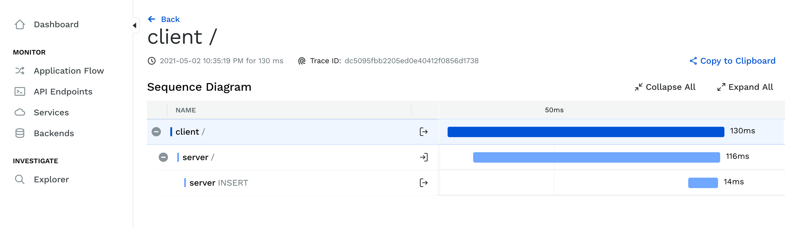

# Pythonagent examples

This folder contains examples for client and server using pythonagent and its instrumentations.



- [Client app](./client): An app doing a call to localhost:9000 using aiohttp.
- [Server app](./server): An app running a flask HTTP server over localhost:9000 and doing a query to a MySQL database.

They can be used separely or together:

```bash
// in terminal 1 run server
make -C ./server run-mysql run-hypertrace
make -C ./server run

// in terminal 2 run client
make -C ./client run
```

Open http://localhost:2020 to find the traces.
